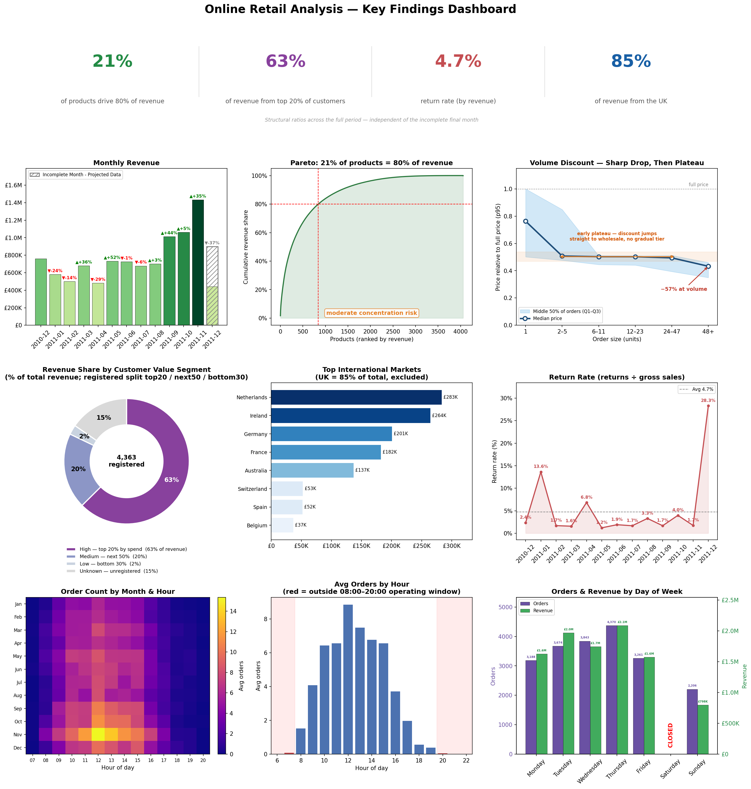

#Online Retail Analysis

End-to-end analysis of ~542,000 transactions from a UK-based online gift retailer
(December 2010 – December 2011) — covering pricing structure, customer segmentation,
product concentration, seasonality, and returns.

A portfolio project demonstrating exploratory data analysis, statistical testing, and
business-focused communication on a public dataset: cleaning messy transactional data,
forming and testing hypotheses, and turning results into actions a business could take —
while being explicit about the limits of the underlying data.



## Key findings

- **Volume discounts are real, but two-tier rather than graduated.** Unit price drops
  sharply with order size, then plateaus — orders are effectively priced at either a
  retail or a deep wholesale rate, with no managed middle tier.
- **Revenue is highly concentrated.** The top 20% of customers generate 63% of revenue;
  the single largest account is a Netherlands-based wholesaler. 14% of revenue comes from
  unregistered customers who can't be segmented.
- **Classic Pareto product concentration.** 21% of products account for 80% of revenue —
  moderate dependency risk.
- **Returns are low and event-driven, not structural** (4.7% by revenue). The genuine
  anomaly is a ~14% January post-Christmas spike; one top product shows a ~95% return
  rate needing supplier review.
- **Customer segments have no natural boundary.** Clustering failed to separate customer
  types cleanly, so segments were defined by deliberate business rules rather than assumed.
- **Growth signal is encouraging but unconfirmed.** A matched first-week-of-December
  comparison suggests +20.2% YoY, but 13 months of data (with a partial final month)
  can't separate seasonality from underlying growth — treated as indicative only.

## Methods

- Spearman correlation for skewed pricing data (Pearson shown for contrast)
- Discount measured as price relative to each product's own list price (95th-percentile
  baseline), pooled across the catalogue and binned into volume tiers
- ANOVA for segment validation, run on `AverageOrderValue` rather than `TotalSpending`
  to avoid circular reasoning (segments are defined by spending)
- Mann-Whitney U for non-parametric two-group comparison; chi-square for return-day
  independence (large-N significance noted as expected; the heatmap is the clearer view)
- KMeans attempted for segmentation; it only isolated outliers, so business-defined
  thresholds were used instead (the failure is shown, not hidden)
- Revenue is measured net of returns; returns are analysed separately. Return rate is
  computed as returns ÷ gross sales (the standard definition).

## Tech stack

- **Python** — pandas, NumPy
- **Visualisation** — Matplotlib, seaborn, Plotly (choropleth)
- **Statistics** — SciPy (`mannwhitneyu`, `ttest_ind`, `f_oneway`, `spearmanr`, `pearsonr`, `chi2_contingency`)
- **ML** — scikit-learn (KMeans, StandardScaler)

## Dataset

UCI Machine Learning Repository — [Online Retail Dataset](https://archive.ics.uci.edu/dataset/352/online+retail).
541,909 transactional line items from a UK online retailer of all-occasion gifts. One row
is a single product line within an invoice. Publicly available and reproducible.

## Repository structure

```
.
├── retail_analysis.ipynb   # full analysis notebook
├── assets/
│   └── dashboard.png       # executive dashboard preview
├── README.md
└── requirements.txt
```

## Running it

```bash
git clone https://github.com/filipburger/retail_analysis.git
cd retail_analysis
pip install -r requirements.txt
jupyter notebook retail_analysis.ipynb
```

`openpyxl` is required because the source file is an `.xlsx`.

## Limitations and future work

The most significant constraints are gaps in the source data, not the analysis:

- **No cost/margin data** — revenue-only; can't identify what's actually profitable.
- **No return reason** — can't separate commercial cancellations from defects.
- **No product category** — limits category-level analysis.
- **No customer-type flag** — wholesale vs retail had to be inferred from spending.
- **13 months, final month partial** — insufficient to separate seasonality from growth.

Natural next steps: demand forecasting for top products, a keyword/regex product classifier
as an interim category proxy.

## Author

**Filip Burger**
[LinkedIn](https://www.linkedin.com/in/filip-burger-109758222/)